## Team:

- Thanasis Anthopoulos: thanasis.anthopoulos@ons.gov.uk
- Fatima Chiroma
- Ian Grimstead: ian.grimstead@ons.gov.uk
- Michael Hodge: michael.hodge@ons.gov.uk
- Sonia Mazi sonia.mazi@ons.gov.uk
- Bernard Peat: bernard.peat@ons.gov.uk
- Emily Tew: emily.tew@ons.gov.uk

## Introduction
Large document collections like patent data, scientific journal applications, job adverts, news articles, tweeter feeds etc. can include valuable insights for policy makers and other government functions. Frequency based methods like TF-IDF or Bag of Word models have proven to be accurate in extracting the key terms and small phrases (2-3 words), but as the number of documents scales up a few technical challenges emerge:
- memory requirements and compute-running time complexity also scale up
- different users maybe have different information retrieval needs. For example, analyzing scientific journal publications one user may be interested for trends in micro-electronics and another in pharmacy

Recent advances in text processing have also demonstrated that it is possible to analyze trends in text documents, by converting the frequency count matrix into a timeseries.
The present report describes the data and methods used to generate such insights from large document collections. The report methods and outcomes are demonstrated using patent data, however the scope of this tool is not limited, but can generate results from any large document collections that feature text and date information.

#### Objectives and scope
The objective of the project is to aid in generating insights from large document collections (≥10,000 documents). Such a collection will share the same theme, such as patents, job adverts, medical journal publications and others. The insights we are aiming to retrieve from these document collections are:
- popular terminology
- emerging terminology

Popular terminology refers to the most frequent keywords and small phrases (up to three words) and emerging terminology refers to keywords that show emerging (or declining) frequency patterns when projected on a time-series scale.

#### Stakeholders
The idea for this project initially came from the Department for Business, Energy and Industrial Strategy (BEIS) and the Intellectual Property Office (IPO). BEIS asked for popular key-terminology to be retrieved from patent applications and IPO came with the idea of retrieving emerging terminology from the same dataset. Both approaches aimed in providing insights from various technology sectors for policy makers. The list below demonstrates various stakeholders that have also expressed an interest in using our pipeline for similar datasets since we started working on this project.
- IPO: emerging terminology from patent data (PATSTAT)
- BEIS: popular terminology from UK patents
- ONS:
    - popular terminology on people survey free-text comments
    - emerging terminology on statistical journal publications data
    - emerging terminology on coroners reports
- DIRAC: emerging terminology in job adverts. Identification of emerging job skills
- Innovate UK: emerging and popular terminology on project grant applications
- MOJ: popular terminology on people survey free-text comments
- GDS: emerging terminology in job adverts and identification of emerging job skills in DDaT profession
- DIT: popular terminology on EU Exit consultations

## Data and methods
In the following sections we list the datasets we used as well as methods employed to process these data and generate the desired outputs to meet our objectives.

#### Data Engineering

The first problem we encountered during this project was receiving data in different formats, such as XML, SQL, CSV, Excel, and each file may have different column names. To overcome this problem and make our pipeline more generic, we decided to convert each data source to [Pandas](https://pandas.pydata.org/) dataframes. For memory, storage and processing efficiency purposes, we decided to only keep three columns in the dataframe; namely text, date and classification (CPC for patents). These fields were adequate to meet the patent project requirements, but could also generalise and process different datasets of interest such as job adverts, publications etc. At the time of publication of this blog the supported formats for generic use are CSV and Excel. Hence potential users whose dataset is not in CSV or XLS format, they should process and export text, date and classification into a .csv or .xls file in order to use our tool.

## Patent Data
The patent datasets we experimented with in this project were:
- PATSTAT
- USPTO
- UK patents

##### PATSTAT
[PATSTAT](https://www.epo.org/searching-for-patents/business/patstat.html#tab-1) is the global patent archive, including approximately ~100 Million worldwide patents dating from the 1960s. The dataset came in a normalised database schema with a number of tables. Dealing with a worldwide patent dataset is tricky as a single patent can be filed in a number of countries, resulting in a number of different data entries. Thankfully PATSTAT keeps a record of this in most of the cases called 'patent family'. Patents in the same family denote a single invention filled in different countries. However, there are more issues when dealing with worldwide text data, as not all countries speak the same language! So if a patent application is not filed in an English speaking territory, its content is lost from our application as it stands today. In the future we could investigate using translators to process these applications in order to include them under the same dictionary of words. After the aforementioned data-processing, the resulting patent counts for this dataset was in the order of ~32 Million documents. The code for processing PATSAT into a pyGrams readable format is included in our [opensource package](https://github.com/datasciencecampus/pyGrams/blob/develop/scripts/utils/import_patstat.py).

##### UK Data

The UK's patent data in the order of 4 Million counts dating from the 1960s too came in XML format. The code for parsing these files is not included in our package yet due to licensing restrictions.


##### US Data
To enable us to use large numbers of patent abstracts as soon as possible, we imported the USPTO's [bulk patent](https://bulkdata.uspto.gov/) dataset, using data from 2004 onwards (as this was stored in a similar XML format to the UK ones). This dataset dates from 2004 onwards. The XML data were scraped from the web using [beautifulsoup](https://www.crummy.com/software/BeautifulSoup/) and exported in data frame format for ingestion into pyGrams. Due to its open source nature and lack of licensing restrictions, this was our dataset of choice to demonstrate results coming out of our pipeline.
## Other datasets
Besides patent data, we have used pyGrams with other text data sources such as job adverts, survey comments, consultation responses and tweeter feeds.

## Objective 1: Popular Terminology

When you type text into a computer it can't understand the words in the way that humans can. For example, the word *'key'* in *'key terms'* implies the computer needs to have some concept of 'meaning' to identify terms as *'key'*. The branch of Data Science responsible for processing and analysing language in this way is known as **Natural Language Processing (NLP)** and it provides many tools that Data Scientists can use to extract meaning from text data. There are two main methodologies for converting text in numerical format in NLP, namely the bag of words (BOW) approach and the word vector representation. Both come with their strengths and weaknesses. The BOW model is a sparse matrix of a dictionary of words or phrases with frequency counts. It is accurate for keyword extraction and allows for small phrases to be included, however it cannot capture context. Word vector representations on the other side, converts terms into high dimensional vectors (50-300d). It can capture context really well for single words, but cannot scale to phrases easily with the same accuracy. Our tool, uses both approaches in different parts of our pipeline


#### Term Frequency - Inverse Document Frequency (TF-IDF)

pyGrams uses a process called Term Frequency - Inverse Document Frequency or **TF-IDF** for short to convert text into numerical form (BOW model with inverse document frequency weighting). TF-IDF is a widely used technique to retrieve key words (or in our case, terms) from a corpus. The output of TF-IDF is a sparse matrix whose columns represent a dictionary of phrases and rows represent each document of the corpus. TF-IDF can be calculated by the following equation:

$
\displaystyle \begin{array}{lll}\\
\displaystyle &&tfidf_{ij} = tf_{ij} * log(\frac{\ N}{df_i}) \\\\
\text{Where:}\\ \\
N & = & \text{number of documents}\\
\ tf_{ij} & = & \text{term frequency for term i in document j}\\
df_i & = & \text{document frequency for term i}\\
tfidf_{ij} & = & \text{TF-IDF score for term i in document j}\\
\end{array}
$

For example, lets say Document 1 contains 200 terms and the term *'nuclear'* appears five times. When the weights are non-normlised:

**Term Frequency** = 5

 Also, assume we have 20 million documents and the term *'nuclear'* appears in ten thousand of these.

**Inverse Document Frequency** = $\ln(\frac{20,000,000}{10,000})$ = 7.6

 Therefore, **TF-IDF weight** for *'nuclear'* in Document 1 = $5 \times7.6 = 38$.

 Eventually this produces a matrix of TF-IDF weights which are summed to create the final TFIDF weight:

| Document_no  | 'nuclear'  | 'electric'  | 'people'  | 'nature' | 'hospital'
|:---:|:---:|:---:|:---:|:---:| :---:|
|  1 | 0.19 | 0.0  | 0.10 | 0.0  | 0.12 |
|  2 | 0.0  | 0.02 | 0.0  | 0.34 | 0.0 |
|  3 | 0.0  | 0.0  | 0.0  | 0.0  | 0.22 |
|  **Final_Weight**  |   **0.19**    | **0.02**  | **0.10**  | **0.34** | **0.34**

Sometimes it is necessary to normalize the TF-IDF output to address variable document sizes. For example if documents span from 10-200 words, a term frequency of 5 in a 30 word document should score higher than the same term frequency on a 200 word document. For this reason we use l2 normalization in pyGrams:

</br>

$\displaystyle l^2_j = \displaystyle\sqrt{\sum_{i=0}^n tf_{ij}}$

</br>

and TF-IDF becomes:

$tfidf_{ij} = \frac{tf_{ij}}{l^2_j} * log(\frac{\ N}{df_i})$

### Producing the TF-IDF matrix in our pipeline

#### Pre-processing
The text corpus is processed so that we strip out accents, ownership and bring individual words into a base form using Lemmatisation. For example, the sentence 'These were somebody's cars' would become 'this is somebody car'. Once this is done, each document is tokenised according to the phrase range requested. The tokens then go through a stop word elimination process and the remaining tokens will contribute towards the dictionary and term-frequency matrix. After the term-count matrix is formed, the inverse document frequency weights are computed for each term and when applied form the TF-IDF matrix.


#### Post processing

#### Issues when using mixed length phrases
There are some issues when using mixed length phrases. That is for a given tri-gram, e.g. 'internal combustion engine', its associated bi-grams 'internal combustion' and 'combustion engine' as well as its unigrams 'internal', 'combustion' and 'engine' will also be counted. To remove double-counting of terms, we post-process the counts and deduct the higher-gram counts from the lower-gram counts in order to have a less biased output of phrases as a result. There are alternatives reported in literature, like the [c-value](https://personalpages.manchester.ac.uk/staff/sophia.ananiadou/IJODL2000.pdf) formula<a href="#ref6">[6]</a>, that we endeavour to include in future versions.

#### Reducing the TF-IDF matrix size
The TF-IDF sparse matrix grows exponentially when bi-grams and tri-grams are included. The dictionary of phrases which forms the columns of the matrix can quickly grow into tens of millions. This has major storage and performance implications and was one of the major challenges for this project, especially when processing datasets like PATSTAT (~32M rows). In order to allow for faster processing and greater versatility in terms of computer specification needed to run the pyGrams pipeline we investigated various optimisations.

We decided to discard low ranked n-grams from the matrix, and also stored document dates as a single integer (rather than a datetime object). The resulting data was then cached.
The matrix optimisation is performed by choosing the top _n_ phrases (uni-bi-tri-grams) where _n_ is user configurable and defaults to 100,000. The top _n_ phrases are ranked by their sum of TF-IDF over all documents. In order to reduce the final object size, we decided to store the term-count matrix instead of the TF-IDF as this would mean that we could use uint8 (i.e. a single byte) instead of the TF-IDF data, which defaults to float64 and is eight bytes per non-zero data element. When the cached object is read back, it takes linear time to calculate and apply the weights so is an acceptable trade-off against storing the full TF-IDF matrix. This reduces the size of the cached serialised object by several orders of magnitude, which means in turn it can be de-serialised faster when read back. This way we managed to store 3.2M US patent data documents in just 56.5 Mb with bzip2 compression. This file is stored on our [github page](https://github.com/datasciencecampus/pyGrams/tree/develop/outputs/tfidf/USPTO-mdf-0.05) and has been used to produce the results in this report.

We also append the command line arguments used to generate our outputs so that readers can reproduce them if they wish. The time it takes to cache the object for the USPTO dataset is six and a half hours on a macbook pro with 16GB of RAM and i7 processor, but subsequent queries run in the order of one minute for popular terminology and a 7-8 minutes for time series outputs without forecasting.

### Filtering
Once the cached object is read we filter rows and columns based on the user query to reduce the number of patents examined and to focus the n-grams we analyse.

### Document filtering
Document filtering comprises:

- date-time filters, restricting the corpus to documents with publication dates within a specified range
- classification filters, restricting the corpus to documents that belong to specified class(es) (for the patents example this is the CPC classification)

### Term filtering

Term filtering removes individual n-grams (columns) from the TF-IDF matrix as opposed to entire patent documents (rows). The different filters are now explained.

#### Stop words

Stop words are words that are ignored as they are are regarded as noise when statistically examining a body of text, and handled using three user configurable files. `stopwords_glob.txt` contains global stop words, including a list of standard English stop words; these stop words are applied before tokenisation. The file `stopwords_n.txt` contains bi-gram or tri-gram stop words; these stop words are applied after tokenisation for phrases containing more than one word. Finally, the file `stopwords_uni.txt` contains unigram stop words and is also applied after tokenisation.

#### Word embedding

The terms filter in pyGrams is used to filter out terms which are not relevant to terms selected by the user. To do this, it uses a GloVe pre-trained word embedding. However, our pipeline can be used with other models such as word2vec or fasttext. GloVe has been chosen for practical purposes as it is low in storage and fast on execution.

##### What is a GloVe pre-trained word embedding?

[GloVe](https://nlp.stanford.edu/projects/glove/) is an unsupervised learning algorithm for obtaining vector representations for words. For a model to be 'pre-trained' the algorithm needs to be trained on a corpus of text where it learns to produce word vectors that are meaningful given the word's co-occurrence with other words. Once the word vectors have been learnt either the Euclidean or the cosine distance between them can be used to measure semantic similarity of the words.

Below is a visual representation of a vector space for the term MEMS  (Micro-Electro-Mechanical Systems):

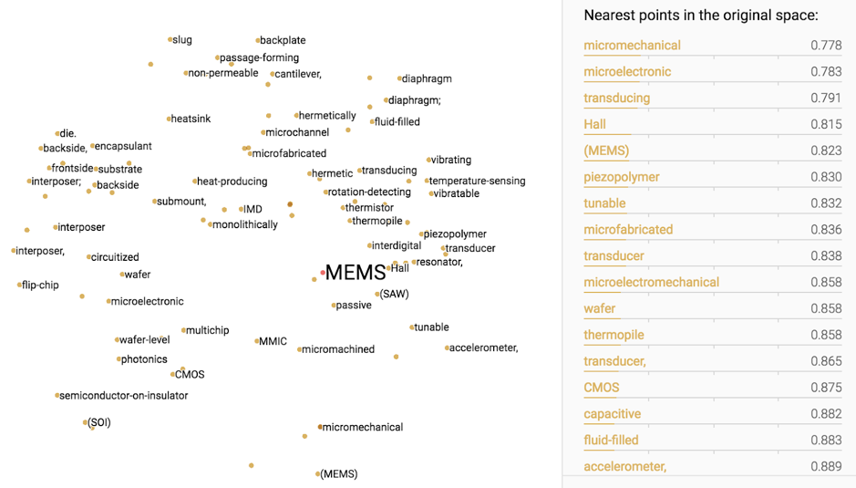

The model used for pyGrams has been trained on a vocabulary of 400,000 words from Wikipedia 2014 and an archive of newswire text data called Gigaword 5. For our purposes, the 50 dimensional vector is sufficient as it reduces the time it takes for the filter to run (particularly with a large dataset).


##### How does it learn word vectors?

Unlike other embedding models, GloVe is a count-based model meaning it is a based on a counts matrix of co-occurring words where the rows are words and the columns are context words. The rows are then factorised to a lower dimensionality (in our case 50) to yield a vector representation that is able to explain the variance in the high dimensionality vector.


##### How does it work in pyGrams?

The user defines a set of keywords and a threshold distance. If the set of user keywords is not empty, the terms filter computes the word vectors of our dictionary and user defined terms. Then it masks out the dictionary terms whose cosine distance to the user defined word vectors is below the predefined threshold.


##### What is the output?

Using our cached object of 3.2 million US patents:

        python pygrams.py -it=USPTO-mdf-0.05

the following popular terms came out as top:

    1. semiconductor device           		3181.175539
    2. electronic device              		2974.360838
    3. light source                   		2861.643506
    4. semiconductor substrate        		2602.684013
    5. mobile device                  		2558.832724
    6. pharmaceutical composition 		    2446.811441
    7. electrically connect           		2246.935926
    8. base station                   		2008.353328
    9. memory cell                    		1955.181403
    10. display device                 		1939.361315

Using the same dataset but adding a terms filter for medical words and a threshold of 0.8:

    python pygrams.py -st pharmacy medicine hospital chemist

the following terms came out as top:

    1. medical device                 847.004068
    2. implantable medical device     376.653856
    3. heat treatment                 278.582799
    4. treatment and/or prevention    168.678058
    5. treatment fluid                132.922168
    6. medical image                  127.059351
    7. medical instrument             123.362187
    8. treatment and/or prophylaxis   114.959887
    9. incorporate teaching           106.151747
    10. medical procedure              99.521356

and further below:

    20. heart failure                  67.600492
    21. medical implant                63.948743
    22. medical application            63.402052
    23. plasma treatment               63.163398
    24. treatment device               59.535794
    25. prosthetic heart valve         57.293541
    26. medical system                 56.428033
    ...
    33. congestive heart failure       48.263174
    34. psychiatric disorder           45.962322
    35. treatment zone                 43.834159
    36. medical treatment              42.929333
    37. treatment system               41.644263
    38. cancer treatment               38.042644
    39. medical imaging system         38.037687
    40. water treatment system         36.578996

To find out how to run term filtering in pyGrams please see the 'Term Filter' section in the [pyGrams README](https://github.com/datasciencecampus/pyGrams#term-filters) found on GitHub.

#### Alternative models
Our pipeline can run with other embedding models, such as [fasttext 300d](https://fasttext.cc/docs/en/english-vectors.html) or [word2vec 200d](https://drive.google.com/file/d/0B7XkCwpI5KDYNlNUTTlSS21pQmM/edit). We decided to default to the GloVe 50 model as it is lightweight and meets GitHub's storage requirements, and for patents it performed similar to other usually better performing models like fasttext. However, on a different text corpus that may not be the case, so the user should feel free to experiment with other models. Our pipeline is compatible with all word2vec format models and they can easily be deployed.

## Objective 2: Emerging Terminology
### From TF-IDF to the time series matrix
In order to assess emergence, our dataset needs to be converted into a time-series. Our approach was to reduce the TF-IDF matrix into a time series matrix where each term is receiving a document count over a period. For example, if the period we set is a month and term 'fuel cell' had a non-zero TF-IDF for seventeen documents, it would get a count of seventeen for this month. Once we obtain the time series matrix, we benchmarked three different methods to retrieve emerging terminology. These were:
- Porter(2018)
- quadratic and sigmoid fitting
- state-space model with Kalman filter

### Emergence scores

#### Porter (2018)
Our first attempts to generate emerging terminology insights were based on emergence scores defined by [Porter (2018)](https://www.researchgate.net/publication/324777916_Emergence_scoring_to_identify_frontier_RD_topics_and_key_players) <a href="#ref1">[1]</a>. This method relied on ten time series periods, the three first being the base period and the following seven the active period. The emergence score is calculated using a series of differential equations within the active period counts, normalised by the global trend.

Active period trend:
$A_{trend} = \frac {\sum_{i=5}^7 C_i}  {\sum_{i=5}^7 \sqrt{T_i}} - \frac {\sum_{i=1}^3 C_i}  {\sum_{i=1}^3 \sqrt{T_i}}$

Recent trend:
$R_{trend} = 10*(\frac {\sum_{i=5}^7 C_i}  {\sum_{i=5}^7 \sqrt{T_i}} - \frac {\sum_{i=1}^3 C_i}  {\sum_{i=1}^3 \sqrt{T_i}})$

Mid period to last period trend:
$S_{mid} = 10*(\frac {C_6}  {\sqrt{T_6}} - \frac { C_3}  { \sqrt{T_3}})$

Emergence score:
$escore=  2 * A_{trend} + R_{trend} + S_{mid}$

This can be visualised, for example with the term 'display device', as:
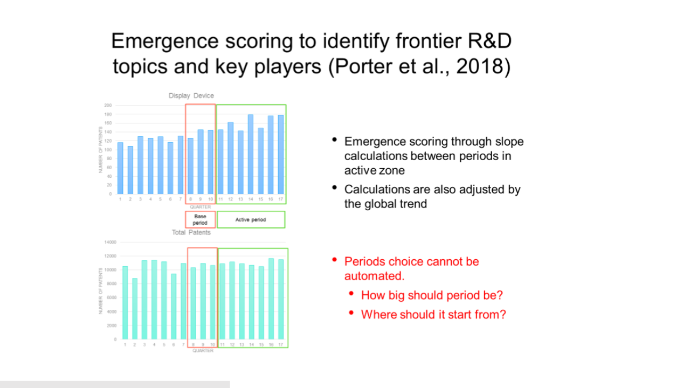

This method works well for terms rapidly emerging in the last three periods as it is expected looking at the equations. However we found that it penalises terms that do not follow the desirable pattern, such as fast emergence at the last three periods. It also takes into consideration the global trend, which sometimes may not be desirable

#### Quadratic and Sigmoid fitting
We decided to investigate alternative methods that would be more generic in the sense that emergence could be scored uniformly in the given time series and normalisation by the global trend would be optional. Our immediate next thought was to fit quadratic or sigmoid curves to retrieve different emerging patterns in our corpus. Quadratic curves would pick trend patterns similar to Porter's method and sigmoid curves would highlight emerged terminology that became stationary. The escore would be the slope of the resulting timeseries.
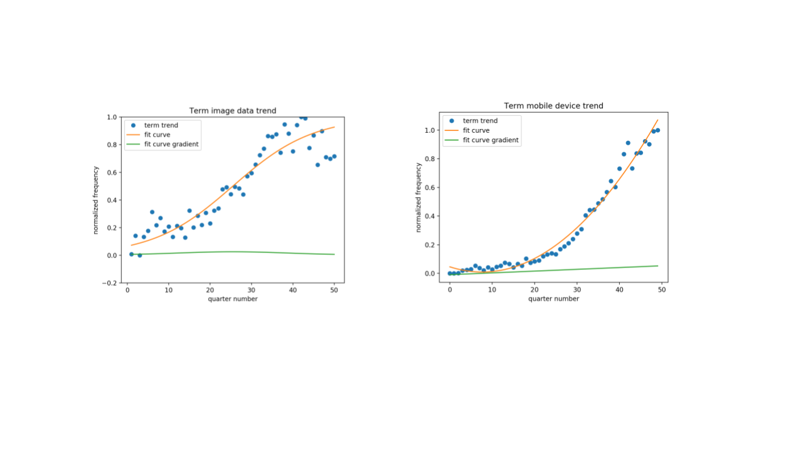

#### Emergence Analysis - Results and Discussion
We benchmarked quadratic fitting with porter's method for our dataset and the results demonstrated in the tables below. The resulting timeseries graphs (not displayed due to space restrictions. TA//it would be nice to fit with a scroll bar. No idea how to do this personally) demonstrate the fact that  Porter's formula's are geared towards scoring emergence in the last 30% of the ten-period timeseries.

One of the big disadvantages of this approach, is the fact that there are many different common curve patterns that a timeseries could look like, such as polynomial ( linear, quadratic, cubic plus others), sigmoid, exponential, logarithmic. It is impossible and costly in runtime and coding to fit all and pick best. However, this gave us the idea that timeseries can be clustered first and different clusters can be analyzed using different curve patterns. At present we only offer quadratic fitting through our pipeline. Also we investigate the use of [Dynamic Time Warping](#dynamic-time-warping) to cluster terms on their timeseries curve pattern. This will help us observe the presence of dominant clusters in various datasets and add other curve fitting methods as we find fit.

#### Porter emergence scores
```python pygrams.py -it=USPTO-mdf-0.05 -cpc=G -ts``` (execution time: 07:23 secs)

    mobile device: 			    33.6833326760551
    electronic device: 		    28.63492052752744
    computing device: 		    25.539666723556127
    display device: 		    23.69755247231993
    compute device: 		    19.604581131580854
    virtual machine: 		    16.725067554171893
    user interface: 		    15.062028899069167
    image form apparatus: 	            14.584135688497181
    client device: 			    13.717931666935373
    computer program product:           13.520757988739204
    light source: 			    13.4761974473862
    display panel: 			    12.987288891969184
    unit configure: 		    11.988598669141473
    display unit: 			    11.928201471077147
    user device: 			    11.207295342544285
    control unit: 			    10.304289943906731
    mobile terminal: 		    8.968774302298257
    far configure: 			    8.710208143729222
    controller configure: 	            8.60326087325161
    determine base: 		    8.435695146267795
    touch panel: 			    8.340320405278447
    optical fiber: 			    7.853598239644436

#### Quadratic emergence scores
```python pygrams.py -it=USPTO-mdf-0.05 -cpc=G -ts -cf``` (execution time: 07:48 secs)

    mobile device: 			    26.93560606060607
    electronic device: 		    24.636363636363637
    computing device: 		    20.659090909090924
    display device: 		    19.962121212121207
    compute device: 		    15.162878787878798
    virtual machine: 		    14.348484848484855
    optical fiber: 			    13.814393939393954
    light source: 			    13.696969696969699
    client device: 			    10.465909090909093
    image form apparatus: 	            10.462121212121222
    display unit: 			    10.272727272727273
    unit configure: 		    10.151515151515154
    user device: 			    9.503787878787884
    display panel: 			    9.223484848484851
    user interface: 		    8.833333333333329
    touch panel: 			    7.844696969696972
    control unit: 			    7.818181818181827
    far configure: 			    7.393939393939394
    computer storage medium: 	    7.234848484848488
    mobile terminal: 		    6.91287878787879
    controller configure: 	            6.560606060606065
    frequency band: 		    6.3212121212121115

The main concern with this method is that not every time series pattern matches a quadratic or a sigmoid curve, in particular time series with multiple curves and stationary points. For this reason we are experimenting with other more flexible approaches like the [state-space model](#state-space-models) and [b-splines](#b-splines).

#### Which method is best?
It all depends on what outcome is desirable. If we wish for a fast output elastically weighted towards the three last periods, considering also the global trend then Porter is best. If we are after a relatively fast output looking at emergence patterns matching a quadratic curve, anywhere in the time series, then quadratic fitting is the best solution. If accuracy and flexibility on the emergence period range is desired, then the state-space model with the Kalman filter, is the best option. pyGrams offers all the above options.

### Timeseries Forecasting
The popular terms are processed to generate emergence scores, and then labelled as emerging (document counts increasing over time), stationary (document counts are static) or declining (document counts are reduced over time).

Given the labels, we take the top 25 emergent, top 25 stationary and top 25 declining terms and run usage predictions on these terms. The top emergent terms are defined as those with the most positive emergence score, the top stationary terms those with a score around 0, and top declining those with the most negative score.

Different prediction techniques were implemented and tested, to determine the most suitable approach to predict future trends. These techniques are now covered in the following sub-sections.

#### Naive, linear, quadratic, cubic
A naive predictor used the last value in each time series as the predicted value for all future time instances. Linear, quadratic, or cubic predictors utilised linear, quadratic, or cubic functions fitted to each time series to extrapolate future predicted values using those fitted parameters.

#### ARIMA<a href="#ref3">[3]</a>

ARIMA (autoregressive integrated moving average) was applied using a grid search optimisation of its (p, d, q) parameters for each time series, based on training on the earliest 80% of the data and testing on the remaining 20% of data.  The grid search parameters were: p = [0, 1, 2, 4, 6], d = [0, 1, 2], q = [0, 1, 2].

#### Holt-Winters<a href="#ref4">[4]</a>

Holt-Winters was applied in its damped exponential smoothing form using an automated option for parameter optimisation for each time series. Holt-Winters' parameters include: alpha (smoothing level), beta (smoothing slope), and phi (damping slope).

#### LSTM <a href="#ref5">[5]</a>

Long Short-Term Memory (LSTM) recurrent neural networks are a powerful tool for detecting patterns in time series; for predicting *n* values, three potential approaches are:

1. Single LSTM that can predict 1 value ahead (but is called *n* times on its own prediction to generate *n* values ahead)
2. Single LSTM that can predict *n* values ahead
3. *n* LSTM models, each model predicts different steps ahead (so merge all results to produce *n* values ahead)

The single LSTM with single lookahead can fail due to compound errors - once it goes wrong, its further predictions are then based on erroneous output. A single LSTM predicting *n* outputs at once will have a single prediction pass and in theory be less prone to compound error. Finally, multiple LSTMs each predicting a different step cannot suffer from compound error as they are independent of each other.

In addition, we use Keras as our neural network library, where LSTMs can be trained as either stateless or stateful. This means that when Keras trains the network, with a stateless LSTM, the LSTM state will not propagate between batches. Conversely, with a stateful LSTM the state will propagate between batches.

#### Prediction Testing - Results and Discussion
pyGrams can be run in a testing mode, where the last *n* values are retained and not presented to the forecasting algorithm - they are used to test its prediction. The residuals of the predictions are recorded and analysed; these results are output as an HTML report. For example, using the supplied USPTO dataset:

```python pygrams.py -it USPTO-mdf-0.05 -ts --test -pns 0```

An extract of the output is shown below:

| terms | Naive	|Linear	|Quadratic	|Cubic	|ARIMA	|Holt Winters	|LSTM |LSTM |LSTM |LSTM|LSTM |LSTM |
|--|--|--|--|--|--|--|--|--|--|--|--|--|
| | | | | | | | **multiLA** | **multiLA** | **1LA** | **1LA** | **multiM 1LA** | **multiM 1LA** |
| | | | | | | | **stateful** | **stateless** | **stateful** | **stateless** | **stateful** | **stateless** |
| Trimmed (10% cut) mean of Relative RMSE | 9.6% | 17.2% | 22.4% | 14.3% | 10.3% | 9.9% | 13.6% | 17.9% | 10.8% | 11.9% | 11.6% | 13.2% |
| Standard deviation of Relative RMSE | 2.8% | 5.3% | 8.5% |8.5% |3.1% |3.0% |9.0% |15.2% |2.3% |5.1% |3.8% |22.5% |

The RMSE results are reported in summary form as above for relative RMSE, absolute error and average RMSE (the different metrics are reported to assist the user with realising that some errors may be relatively large but if they are based on very low frequencies, they are less of a concern - absolute error will show this; similarly a low relative error may actually be a large absolute error with high frequency counts, so we inform the user of both so they can investigate). The summary tables are then followed with the breakdown of results against each tested term (by default, 25 terms are tested in each of emergent, stationary and declining). An example test output is shown below for two emergent terms:

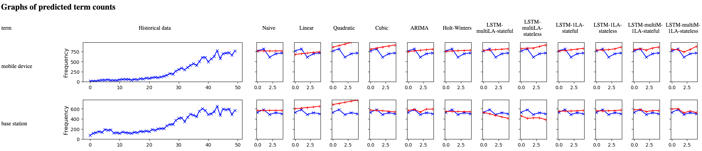

After examining the output, the predictors for five time periods ahead with lowest trimmed mean and standard deviation of relative root mean square error (of predicted vs actual) were found to be: naive, ARIMA, Holt-Winters, stateful single LSTM with single look-ahead and stateful multiple LSTMs with single look-ahead.

As a comparison, we also ran a predictor for ten time periods ahead:

```python pygrams.py -it USPTO-mdf-0.05 -ts --test -pns 0 -stp 10```

| terms | Naive	|Linear	|Quadratic	|Cubic	|ARIMA	|Holt Winters	|LSTM |LSTM |LSTM |LSTM|LSTM |LSTM |
|--|--|--|--|--|--|--|--|--|--|--|--|--|
| | | | | | | | **multiLA** | **multiLA** | **1LA** | **1LA** | **multiM 1LA** | **multiM 1LA** |
| | | | | | | | **stateful** | **stateless** | **stateful** | **stateless** | **stateful** | **stateless** |
| Trimmed (10% cut) mean of Relative RMSE | 16.6% | 19.9% | 30.2% | 24.1% | N/A | 11.6% | 20.1% | 31.2% | 13.5% | 23.2% | 15.1% | 32.0% |
| Standard deviation of Relative RMSE | 8.9% | 9.7% | 12.5% | 15.7% | 6.5% | 9.7% | 63.8% | 40.8% | 8.2% | 26.7% | 6.9% | 27.3% |

The same two terms have their test output below for comparison with the previous five time period results:

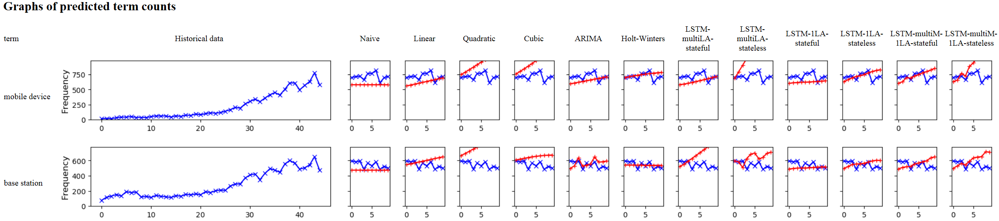

The RMSE results show that the multiple model stateful LSTM now improves - giving better results than the single model, reflecting the accumulation of error in the single output model LSTM. The multiple outputs single model LSTM is now much worse, indicating that the model had not learnt the complex shape of the data. Finally, the naive results are now worse than ARIMA and the two LSTM models; only Holt-Winters is worse than the naive approach. This indicates that the short term random variation will not move significantly far away from the last known value, but over time it will drift and cause the naive approach to degrade as an estimate.

In summary and for our USPTO patent dataset, the naive predictor is suitable for short-term forecasts, whereas ARIMA, Holt-Winters and stateful single model, single output LSTM are better suited to longer term forecasts. The multiple model, single output LSTM produced improved results with longer forecast periods, but runs significantly slower (for _N_ time periods, this requires _N_ models and hence trains _N_ times slower than the single model, single output LSTM).
It seems that the naive model performs well for short predictions due to the 'white noise' that our dataset demonstrates. Repeating the same value for the short term prediction has a good chance to get the lowest error on a noisy series. In the long term, where the timeseries may have drifted away from the last historical point, the naive has less chance of successful predictions and a good algorithm should perform better.
It will be interesting to repeat these experiments on the smoothed timeseries that we can get using the state-space model with the kalman filter. This should demonstrate less bias compared to the predictions made with the noisy series and make the naive model less strong a predictor compared to the others.

## Usage Examples
This section  demostrates example usage and outputs from the pyGrams pipeline  run on the example USPTO dataset of 3.2M patents. Emergence scoring performed using Porter and predictions generated from naive, ARIMA, Holt-Winters and stateful single LSTM with single look-ahead:

```python pygrams.py -it USPTO-mdf-0.05 -ts -pns 1 5 6 9```

Various outputs are produced; first, the top 250 popular terms are listed:

    1. semiconductor device           3181.175539
    2. electronic device              2974.360838
    3. light source                   2861.643506
    4. semiconductor substrate        2602.684013
    5. mobile device                  2558.832724
    6. pharmaceutical composition     2446.811441
    7. electrically connect           2246.935926
    8. base station                   2008.353328
    9. memory cell                    1955.181403
    10. display device                 1939.361315


Top emergent terms:

    mobile device: 29.820764545328476
    base station: 21.845790614296153
    user equipment: 20.68596854844115
    computer program product: 18.63254739799396

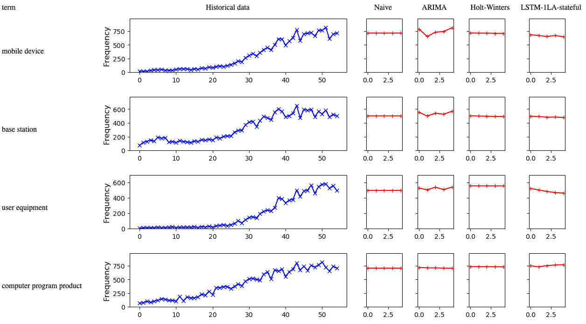

Top stationary terms:

    fuel injection: 0.0004264722186599623
    key performance indicator: 7.665313838841475e-05
    chemical structure: -1.9375784177676214e-05
    subsequent stage: -8.295764831296043e-05

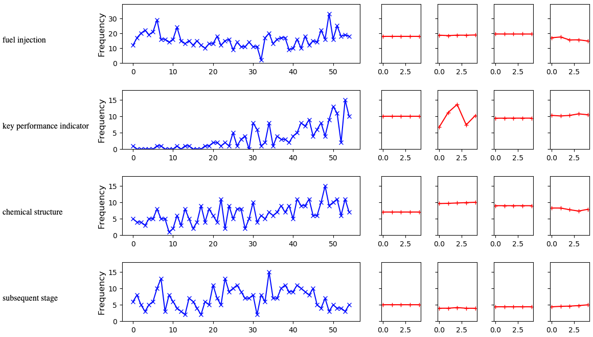

Top declining terms:


    plasma display panel: -5.010357686060525
    optical disc: -5.487049355577173
    semiconductor substrate: -6.777448387341435
    liquid crystal display: -8.137031419798937


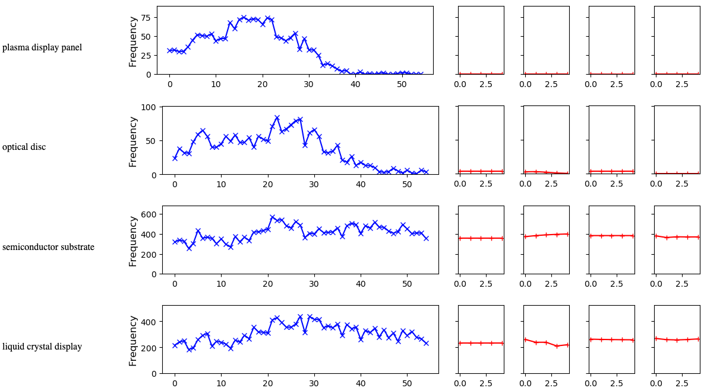

Each graph is accompanied with a table, where we flag the forecast to be emergent, stationary or declining. The user is provided the table as a synopsis of the results, and they can scroll down to the detail in the graphs to discover why a term was flagged. To generate the labels, the predicted term counts are normalised so that the largest count is 1.0; a linear fit is then made to the prediction, and the gradient of the line is examined. If it is above 0.02, we flag as emergent, below -0.02 as declining otherwise stationary. We have also added "rapidly emergent" if the gradient is above 0.1 to highlight unusually emergent terms.

The results show that very few of the terms are predicted to be emergent or decline in the future, which reflects the success of the naive predictor in testing. Those terms flagged a non-stationary are of interest; such as "liquid crystal display" flagged as declining, which given the move towards OLED and related technologies would appear to be a reasonable prediction. This shows, however, that a user needs domain knowledge to confirm the forecasts; the forecasts are dealing with large amounts of noise and hence can only give approximate guidance.

As a comparison, we also ran the same experiment but using term filtering against 'physics':

```python pygrams.py -it USPTO-mdf-0.05 -ts -pns 1 5 6 9 -st physics```

Various outputs are produced; first, the top 250 popular terms are listed:

    1. pharmaceutical composition     2446.811441
    2. computing device               1086.709665
    3. provide composition            349.350010
    4. planetary gear set             325.311414
    5. information associate          314.077127
    6. computing system               309.015119
    7. biological sample              301.999783
    8. electromagnetic radiation      294.998838
    9. prior art                      290.421514
    10. radiation source               287.796504

Top emergent terms:

    computing device: 40.022921674924206
    pharmaceutical composition: 29.937440463464487
    information associate: 9.449455399162229
    radio access technology: 6.712564447400591

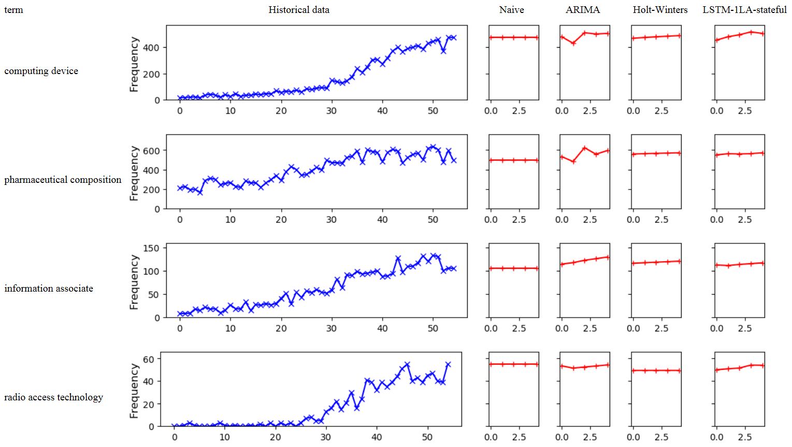

Top stationary terms:

    mechanical connection: 0.010227567459690001
    laser radiation: 0.0034510619228323436
    logic unit: -0.0028314722774545054
    pharmaceutical formulation: -0.003476640251601243

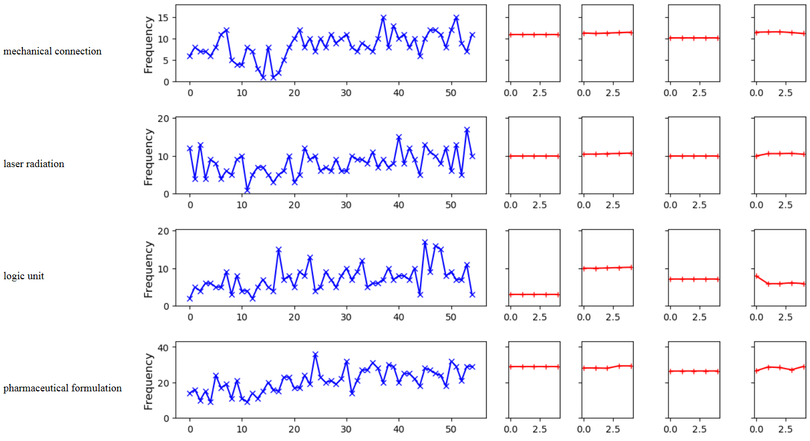

Top declining terms:

    logic circuit: -3.7455083518431405
    programmable logic device: -4.228998619987032
    plasma display: -4.235591159894808
    plasma display panel: -14.599067980826895

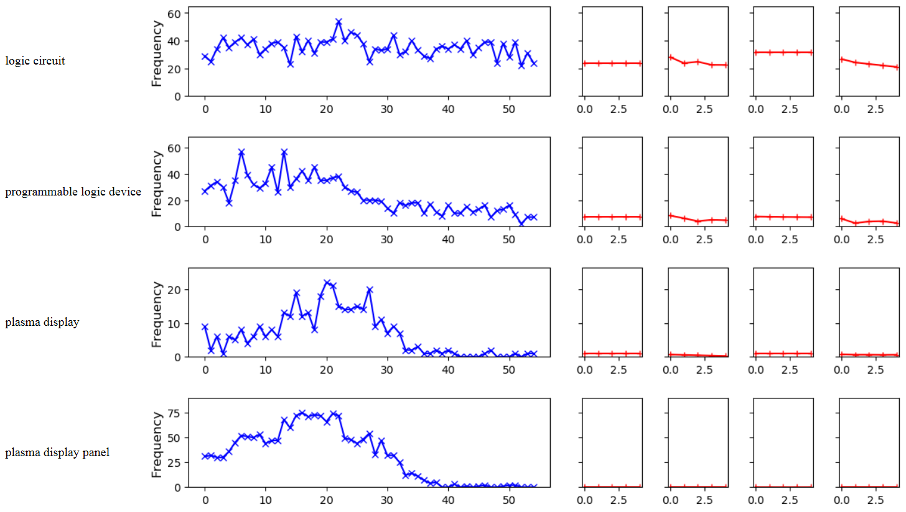

The prediction results are as expected - emerging results are predicted to continue to grow, stationary aren't predicted to grow and declining are predicted to decline (or remain at zero usage). Interestingly the use of "logic circuit" is flagged as declining, but isn't obviously showing a dramatic decline such as shown by "programmable logic device"; however, both ARIMA and the LSTM predict decline.

## Outputs

All the outputs we have seen so far came from running different commands in pyGrams. The emerging and popular terminology is listed with scores in two different text files. Also all the timeseries data are saved as a .csv file available for the user to visualize or further process at will. The timeseries along with the requested predictions (if any), are also available in html format to display in browser, one for each outcome: emerging, stationary and declining terms. All these outputs can be found in the /outputs folder. Further to these outputs pygrams can generate wordclouds and term graphs invisual and textual format

### Terms Graph
When graph is requested by the user, a graph data-structure is created where neighbouring nodes are co-occuring terms in a document. Links between neighbouring nodes store the frequency at which the two-terms co-occur. This graph can be output as a visual force-directed graph or a summary text.
### Force-Directed Graphs (FDG)
Terms which co-occur in documents are revealed by this visualisation; terms are shown as nodes in a graph, with links between nodes if the related terms appear in the same document.
The size of the node is proportional to the popularity score of the term, and the width of the link is proportional to the number of times a term co-occurs.
An example visualisation of the USPTO dataset can be generated with ```python pygrams.py  -it USPTO-mdf-0.05 -o=graph```, an example output is shown below.

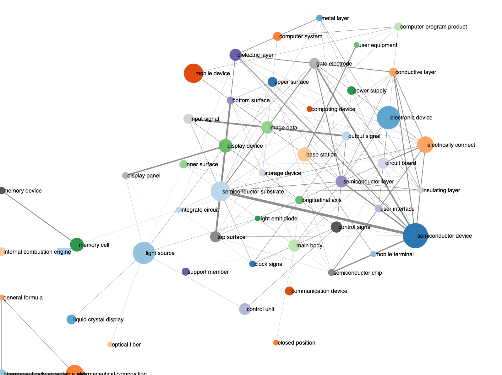


### Graph summary
The graph of co-occurring terms is also output on a text report when an FDG is generated; it is of the form:

1. semiconductor device: 3181.18  -> semiconductor substrate: 1.00, gate electrode: 0.56, semiconductor chip: 0.48, semiconductor layer: 0.46, insulating film: 0.36, dielectric layer: 0.34, conductive layer: 0.33, active region: 0.31, insulating layer: 0.29, gate structure: 0.27
2. electronic device: 2974.36  -> circuit board: 0.14, main body : 0.12, electronic component: 0.10, electrically connect: 0.08, portable electronic device: 0.07, display unit: 0.06, electronic device base: 0.06, user interface: 0.06, external device: 0.05, power supply: 0.05
3. light source: 2861.64  -> light guide plate: 0.33, light beam: 0.32, light emit: 0.23, light guide: 0.20, emit light: 0.17, light source unit: 0.13, optical element: 0.12, optical system: 0.12, lighting device: 0.11, liquid crystal display: 0.11
4. semiconductor substrate: 2602.68  -> semiconductor device: 0.59, gate electrode: 0.32, dielectric layer: 0.23, insulating film: 0.21, active region: 0.21, conductivity type: 0.19, semiconductor layer: 0.18, drain region: 0.15, insulating layer: 0.14, channel region: 0.14
...

This is output can act as a summary and also as context. It is important to see how popular or emerging terminology is mostly used in the documents.

### Word clouds
pyGrams can also generate the ever so popular wordclouds. As it stands at the moment we only do this for popular terminology, but can easily extend to emerging terms if there is demand for it. An example visualisation of the USPTO dataset can be generated with ```python pygrams.py  -it USPTO-mdf-0.05 -o=wordcloud```, an example output is shown below.

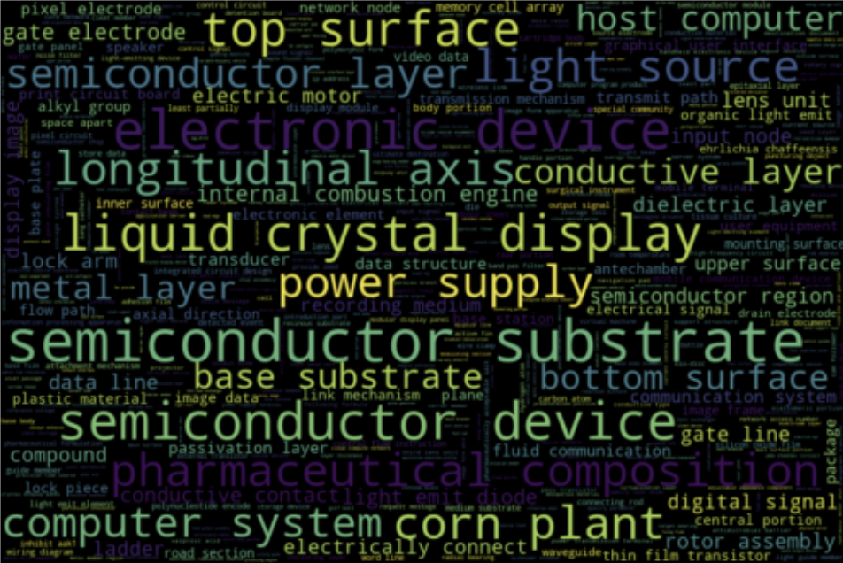

## C-ChartoGram
This is a map that displays where and when different technologies have been invented. Most terminology coming out of the patent documents is associated with a particular technology that was invented at some place at a particular time point. The [Patents C-Chartogram](https://pygrams-patloc.s3.eu-west-2.amazonaws.com/index.html) ( sort for ChronoChartoGram ) has been designed with the js cross-filter library, which allows for fast filtering between the time-place-technologies dimensions. For technical details on its technical design please [read-this-blog] (#c-chart-blog).

## Ongoing and Future work

The methods and results so far refer to completed an reproducable work available through [pyGrams](https://github.com/datasciencecampus/pyGrams) github repository. There is a backlog of ideas and methods that we are currently evaluating and include in the tool on future versions. Most of them in the area of timeseries interpretation and emergence scoring. The present section lists the most notable ones.

### State space models
State space models with a Kalman filter have proved to be a very flexible approach in timeseries analysis. We decided to experiment with this method for our patents dataset and we immidiately seen some potential in the sense that we could analyze a smoothed version of the timeseries whose derivative gives us the growth rate. This growth rate we believe would be more accurate from second degree polynomial fittings that we tried in the past as it will not suffer from poorly fit curves anymore.Using this method, we can either look for an emergence score between two user defined points or look at the longest uphill curve section or the steepest section using simple calculus equations.

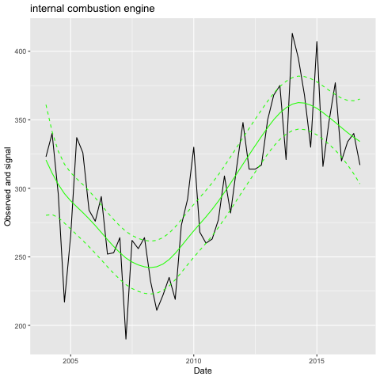 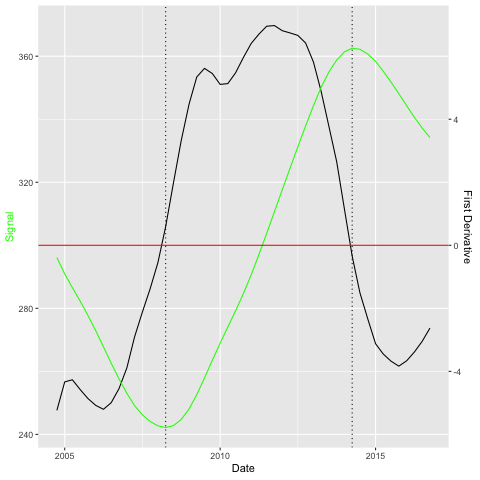

We have been experimenting with different emergence scoring formulas and we concluded into using the growth rate to assess emergence [emergence_index_paper_link_here]. The disadvantage of this method over the previous two (Porter and quadratic or sigmoid fit) is the fact that it is slower as the Kalman filter needs parameter optimisation.

### b-splines
This was a lower priority proposal for us and we decided to partner with the data-science department of Cardiff University to investigate initially as a master's thesis. We endeavour to compare results between b-splines and the state-space model once ready in terms of execution performance and accuracy. Potentially we hope to be able to integrate into the pyGrams pipeline.

### Dynamic time warping
This is another project proposal currently being investigated in partnership with Cardiff University. We aim to be able to cluster 100s of thousands of timeseries resulting from our datasets processed through our pipeline. If successful, this can contribute in a number of ways towards our outputs:
- investigate relationships between keywords in similar groups. Is one technology enabling another?
- analyze clusters in isolation for faster or more focused processing. For example analyze and forecast emergence for terms showing a sigmoid timeseries pattern.

## Conclusions
This report demonstrates methodology and results from pyGrams, an open source text processing pipeline that we developed in DSC that outputs timeseries trends from large document collections. Our results in this report were random information retrieval queries to demonstrate how the tool works. Evaluation of the tool will be completed in due course by the IPO and possibly from other research groups in ONS analysing research publications.

## References

1. <p id="ref1">Porter, A.,  Garner, J., Carley, S, and Newman, N. (2018). Emergence scoring to identify frontier R&D topics and key players. Technological Forecasting and Social Change. 10.1016/j.techfore.2018.04.016.</p>
2. <p id="ref2">de Jong, P. (1991). The diffuse Kalman filter. The Annals of Statistics. Vol.19, No.2, pp.1073-108.</p>
3. <p id="ref3">Perktold, J, Seabold, S., and Taylor, J. (2019). Autoregressive Integrated Moving Average ARIMA(p,d,q) Model. https://www.statsmodels.org/dev/generated/statsmodels.tsa.arima_model.ARIMA.html. Retrieved 6.6.2019.</p>
4. <p id="ref4"> Perktold, J, Seabold, S., and Taylor, J. (2019). Holt Winter’s Exponential Smoothing. https://www.statsmodels.org/dev/generated/statsmodels.tsa.holtwinters.ExponentialSmoothing.html. Retrieved 6.6.2019.</p>
5. <p id="ref5"> Zhang, J. and Nawata, K. (2018). Multi-step prediction for influenza outbreak by an adjusted long short-term memory. Epidemeiology and Infection. May 2018, Vol.146, No.7, pp.809-816. doi: 10.1017/S0950268818000705. Epub 2018 Apr 2.</p>
6. <p id="ref6"> Frantzi K. Ananiadou S, Mima H. (2000). Automatic Recognition of Multi-Word Terms: the C-value/NC-value Method. International Journal on Digital Libraries.</p>
